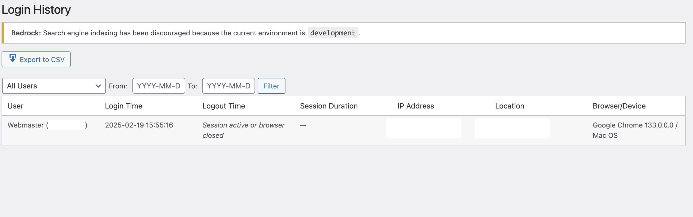
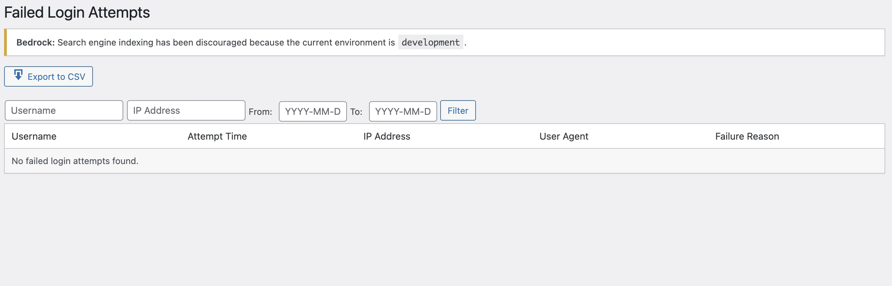
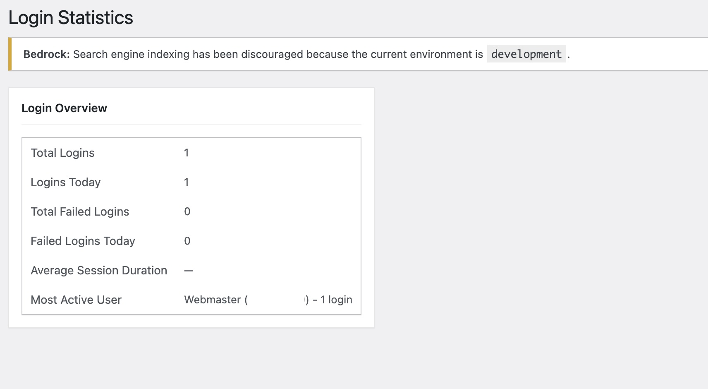
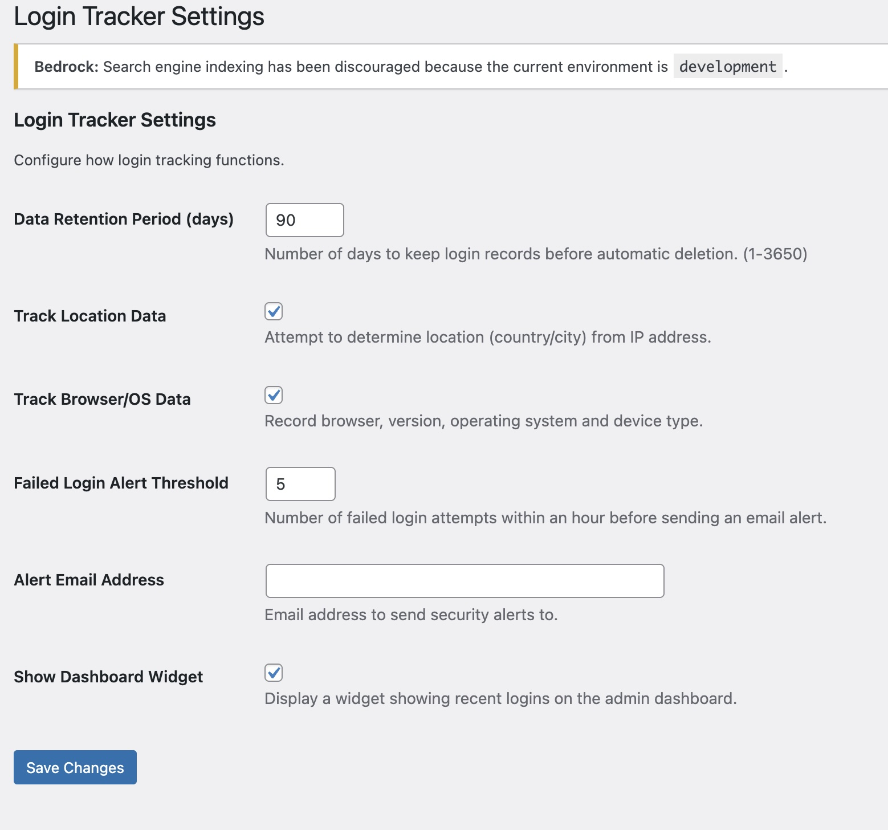

<div align="center">


# Custom Login Tracker

**Track and monitor WordPress user login activity with detailed statistics and enhanced security features.**

[](https://wordpress.org/)
[](https://php.net/)
[](https://github.com/MeonValleyWeb/wordpress-login-tracker/releases)
[](https://github.com/MeonValleyWeb/wordpress-login-tracker/actions)
[](LICENSE)
[](https://twitter.com/meonvalleyweb)

</div>

---

Custom Login Tracker provides comprehensive monitoring of user login activity in your WordPress site. Designed to work seamlessly with Bedrock architecture, this plugin helps administrators keep track of who is accessing the site, when, and from where.

---

## Features

- **✅ Successful Login Tracking** - Record user information, location, browser, and device details
- **🚫 Failed Login Monitoring** - Track failed login attempts with IP tracking
- **⏱️ Session Duration** - Calculate how long users stay logged in
- **🌍 Geolocation** - Track the geographical origin of logins
- **🔔 Security Alerts** - Receive email notifications for suspicious login activity
- **🗑️ Customizable Retention** - Set how long login data is stored
- **📊 Data Export** - Export login history to CSV for reporting and compliance
- **📈 Dashboard Widget** - Get a quick overview of recent login activity
- **📉 Detailed Statistics** - Analyze login patterns and user behavior

---

## Perfect For

- Security-conscious websites
- Membership sites
- Multi-author blogs
- Sites requiring compliance documentation
- Bedrock-based WordPress installations

---

## Installation

### From WordPress.org (Recommended)

1. Go to **Plugins → Add New** in your WordPress admin
2. Search for "Custom Login Tracker"
3. Click **Install** then **Activate**

### Manual Install

1. Download the latest release from [GitHub Releases](https://github.com/MeonValleyWeb/wordpress-login-tracker/releases)
2. Upload to `wp-content/plugins/custom-login-tracker/`
3. Activate in **Admin → Plugins**

### Composer (Bedrock)

```bash
composer require meonvalleyweb/custom-login-tracker
```

---

## Configuration

After activation, visit **Users > Login Tracker Settings** to configure:

- Data retention period (days to keep login records)
- Location tracking (enable/disable)
- Browser and device tracking (enable/disable)
- Failed login alert threshold
- Alert email address
- Dashboard widget visibility

---

## Screenshots

<table>
<tr>
    <td width="25%">
        
        <p align="center"><em>Login History Dashboard</em></p>
    </td>
    <td width="25%">
        
        <p align="center"><em>Failed Login Attempts</em></p>
    </td>
    <td width="25%">
        
        <p align="center"><em>Statistics Overview</em></p>
    </td>
    <td width="25%">
        
        <p align="center"><em>Settings Page</em></p>
    </td>
</tr>
</table>

---

## Testing

This plugin includes a comprehensive test suite:

```bash
# Install dependencies
composer install

# Run coding standards check
composer run phpcs

# Run unit tests
composer run phpunit

# Run full test suite
composer run test
```

---

## Frequently Asked Questions

### Does this plugin work with Bedrock?
Yes, Custom Login Tracker is specifically designed to work with Bedrock architecture.

### Will this plugin slow down my site?
No, the plugin has minimal impact on site performance. Login tracking happens asynchronously and doesn't affect the user experience.

### How long is login data stored?
By default, login data is stored for 90 days, but this can be configured in the settings.

### Can I export the login data?
Yes, you can export both successful logins and failed login attempts to CSV format.

### Is location data accurate?
The plugin uses IP-based geolocation which provides city/country level accuracy. It's not 100% precise but gives a good general indication of login origins.

### Does this work with WooCommerce or membership plugins?
Yes, the plugin tracks all WordPress logins regardless of how they're initiated.

---

## Changelog

### 1.1.0 - 2025-05-14
- Enhanced tracking of browser and device information
- Added data export functionality
- Improved dashboard widget
- Added statistics page
- WordPress.org submission preparation

### 1.0.0
- Initial release

---

## Roadmap

### Upcoming Free Version Enhancements

1. **Role-Based Analytics**
   - Track login patterns by user role
   - Show which roles are most active/inactive

2. **Basic Security Improvements**
   - Implement automatic temporary IP blocking after X failed attempts
   - Add a simple login attempt limiter

3. **Dashboard Improvements**
   - Weekly/monthly summary reports
   - Basic visual charts showing login activity

### Future Pro Version Features

- Real-time threat detection with AI/machine learning
- IP reputation checking against known threat databases
- Multi-factor authentication tracking
- Custom security policies based on time, location, device
- Advanced reports & visualization with custom report builder
- Scheduled email reports (daily/weekly/monthly)
- User behavior analysis
- Compliance tools for GDPR/HIPAA/SOC2

---

## Contributing

Contributions are welcome! Please feel free to submit a Pull Request.

1. Fork the repository
2. Create your feature branch: `git checkout -b my-new-feature`
3. Commit your changes: `git commit -am 'Add some feature'`
4. Push to the branch: `git push origin my-new-feature`
5. Submit a pull request

---

## Credits

**Author:** [Andrew Wilkinson](https://github.com/MeonValleyWeb)  
**Company:** [MeonValleyWeb](https://meonvalleyweb.com)  
**Twitter:** [@meonvalleyweb](https://twitter.com/meonvalleyweb)

---

## License

GPL v2 or later. See [LICENSE](LICENSE) for details.

---

## Support

For support, please visit [https://meonvalleyweb.com/support](https://meonvalleyweb.com/support) or email support@meonvalleyweb.com.
